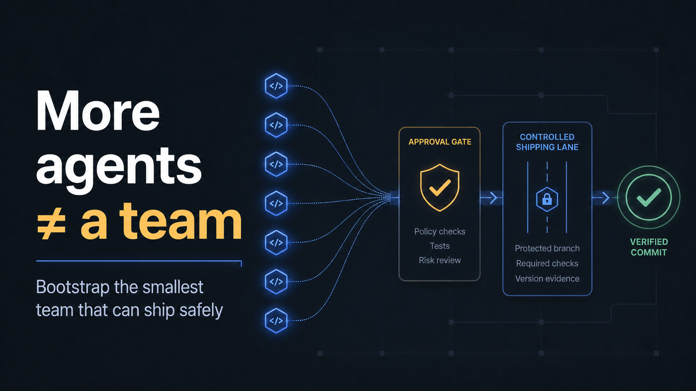
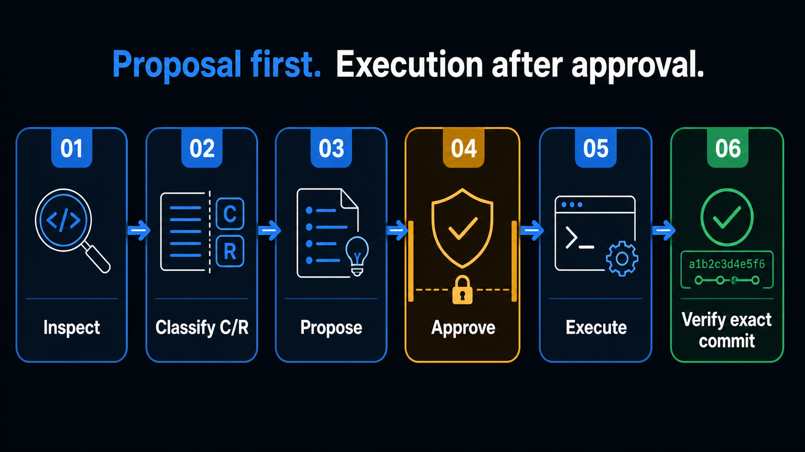
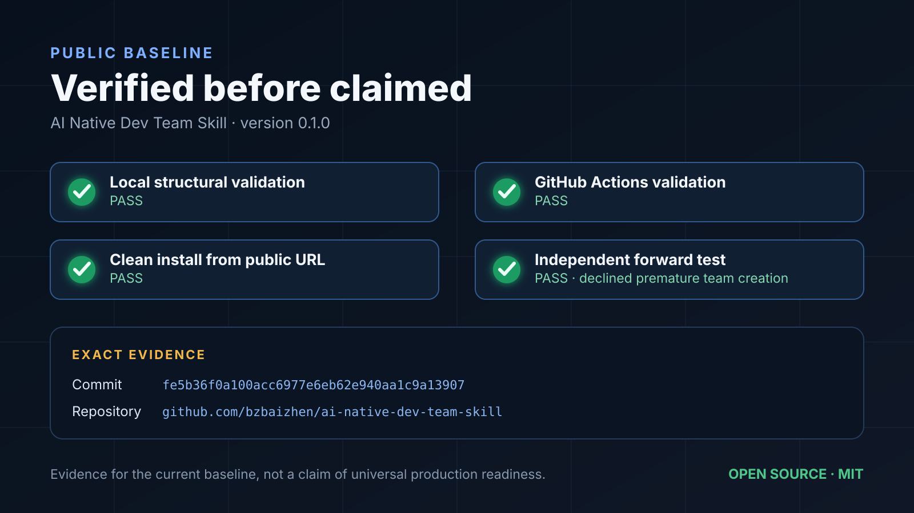

# AI-Native Dev Team Skill

[English](README.md) | [简体中文](README.zh-CN.md)

**Bootstrap the smallest AI software team that can ship safely — with explicit ownership, independent validation, version-bound evidence, and recovery built in.**



[Install](#install) · [How it works](#how-it-works) · [Cost-aware routing](#cost-aware-model-and-reasoning-routing) · [Why this is different](#why-this-is-different)

## The problem

Most multi-agent demos optimize for the number of agents running at once. Real software delivery fails elsewhere:

- nobody owns the final decision;
- two agents edit the same file;
- QA validates a different commit;
- a prototype inherits production-scale ceremony;
- a push is mistaken for a recoverable backup;
- planned work is reported as completed work.

This Skill treats the main agent as a control plane and specialist agents as temporary, permission-bounded execution units. It asks two questions first: **does this task need delegation at all, and what is the lowest-cost capability that can pass its quality gates?**

## What it provides

- proposal-first team initialization;
- four delivery routes: `no-delegation`, `single-worker`, `task-cell`, and `team-required`;
- separate `C0-C3` complexity and `R0-R3` risk classification;
- cost-aware model and reasoning routing that targets the lowest expected cost per accepted task, not the cheapest token or the strongest model by default;
- Lean, Controlled, and Strict governance loaded only when justified;
- business owner, producer/main agent, implementer, validator, and optional specialist boundaries;
- one-owner-per-file and task-scoped write leases;
- contract-first parallelism with branch/worktree/PR isolation;
- independent task review and exact-commit evidence;
- explicit stop, approval, rollback, backup, and recovery rules;
- reusable project charter, task contract, and evidence manifest templates;
- a standard-library event ledger CLI for cycle time, integration wait, capability routing, governance share, and hard-gate audits;
- audit and team-resizing modes for existing projects.

## Install

Ask Codex to install the Skill from this repository:

```text
$skill-installer install https://github.com/bzbaizhen/ai-native-dev-team-skill/tree/main/skills/bootstrap-ai-native-dev-team
```

Or copy `skills/bootstrap-ai-native-dev-team` into a supported user or repository Skill directory.

For consistent automatic use across projects, add the compact rule in [`examples/global-agents-snippet.md`](examples/global-agents-snippet.md) to your global `AGENTS.md`. The global rule triggers the workflow; the Skill holds the detailed procedure so ordinary tasks stay lightweight.

## Use

Explicit invocation:

```text
Use $bootstrap-ai-native-dev-team to propose the smallest safe AI-native development team for this repository. Do not modify files yet.
```

Other examples:

- “Initialize this MVP with the minimum useful AI development team.”
- “Can the frontend and backend agents work in parallel safely?”
- “Audit our current agent team, worktrees, QA gates, and recovery plan.”
- “Resize the team now that this project is preparing for production.”

The default mode is `proposal`: no agents, branches, worktrees, or governance files are created until the applicable scope is approved.

## How it works



```text
inspect primary evidence
        ↓
confirmed facts / inferences / to verify
        ↓
complexity C0-C3 + risk R0-R3
        ↓
no-delegation / single-worker / task-cell / team-required
        ↓
main agent / economy / standard / advanced / frontier
        ↓
Lean / Controlled / Strict governance
        ↓
ownership + contracts + approvals + rollback
        ↓
approval-ready proposal
        ↓ approved scope only
initialize → implement → independent validation → acceptance → recovery record
```

See [`examples/sample-proposal.md`](examples/sample-proposal.md) for a compact output.

## Cost-aware model and reasoning routing

The two-axis classification is also a routing system:

| Signal | What it changes |
|---|---|
| Complexity `C0-C3` | Executor capability, reasoning effort, context preparation, and whether the task should be decomposed |
| Risk `R0-R3` | Permissions, independent validation, approval depth, rollback evidence, and stop conditions |
| Project evidence | First-pass acceptance, rework, latency, and cost per accepted task |
| Runtime availability | The active model mapping, declared fallback, main-thread takeover, or a stop |

This separation matters. A `C1/R3` production configuration change may use an economical implementation model while requiring specialist review, owner approval, and rollback evidence. A `C3/R1` pure refactor may justify the strongest reliable model and highest reasoning effort without production-grade approval ceremony.

The target is **the lowest expected total cost that still clears the quality and risk gates**:

```text
accepted-task cost = execution + likely retry/rework + validation + coordination
```

Model names are not hard-coded into the general workflow. Each project maps currently available models to the complexity levels, records an allowed fallback, and must not claim that a requested model ran when the runtime did not provide it. When evidence is weak, the workflow escalates capability or reasoning, decomposes the task, returns it to the main thread, or stops.

The main agent remains the high-context information hub. `C0` does not automatically mean “use the main agent”: tiny control-plane work stays there, while delegated mechanical batches use the Economy/Low tier. Ordinary workers receive a bounded contract and do not reload the full team Skill.

## Proportional governance and measurable flow

V2 replaces the monolithic governance reference with progressive profiles:

| Profile | Default use |
|---|---|
| Lean | C0/C1, R0/R1, at most one Writer |
| Controlled | C2, R2, behavior-changing task cells, contract-sensitive or parallel work |
| Strict | C3, R3, production, security/privacy, migration, or public release |

The main agent writes a minimal prospective ledger at `.ai-team/metrics/events.jsonl`. The CLI records lifecycle events and reports `READY → accepted` cycle time, `dev_complete → accepted` wait, accepted tasks per active Agent hour, governance share, low-cost C0/C1 routing, and hard-gate violations. “Accepted” means the exact validated change reached the stable branch.

## Why this is different

This project combines useful patterns found in mature agent-development projects, then adds a governance layer for traceability and recovery:

- [obra/superpowers](https://github.com/obra/superpowers): task-scoped subagent development, worktrees, review loops, and verification before completion.
- [wshobson/agents](https://github.com/wshobson/agents): team-composition patterns, task coordination, file ownership, and parallel feature development.
- [github/awesome-copilot](https://github.com/github/awesome-copilot): producer, developer, and optional QA role separation.

The workflow in this repository is independently authored. Its additional focus includes proposal-first authorization, separate complexity/risk routing, business-owner authority, write leases, immutable evidence, native-environment boundaries, backup semantics, and recovery drills.

It deliberately does **not** create a fixed eight-agent pipeline or run every task on the most expensive model. Roles and model effort are allocated by the work; risk is handled with stronger evidence and authority rather than blindly increasing inference cost.

## Repository layout

```text
skills/bootstrap-ai-native-dev-team/
├── SKILL.md
├── agents/openai.yaml
├── references/
│   ├── routing-and-topologies.md
│   ├── governance-lean.md
│   ├── governance-controlled.md
│   ├── governance-strict.md
│   ├── metrics.md
│   ├── metrics-event.schema.json
│   ├── release-anchor-closure.schema.json
│   ├── release-registration-receipt.schema.json
│   ├── release-source-registry.schema.json
│   ├── release-trial-evidence.schema.json
│   ├── release-v1-baseline-evidence.schema.json
│   └── release-trial-manifest.schema.json
├── scripts/
│   ├── team_metrics.py
│   └── v2_release_gate.py
└── assets/
    ├── team-bootstrap-proposal.md
    ├── project-team-charter.md
    ├── task-contract.md
    ├── evidence-manifest.yaml
    └── metrics-handoff.yaml
```

`docs/images/social-preview.png` is the candidate asset for this repository's GitHub Social Preview; committing it does not change the repository setting.

## Validation



```bash
python tests/validate_skill.py
python -m unittest discover -s tests -p "test_*.py" -v
```

The repository includes a GitHub Actions workflow for the same structural checks.

## Status

`v1.0.0` is the frozen baseline. `v2.0.0-rc.1` added cost-aware execution routing, progressive governance, prospective metrics, and hard-gate audits. RC.2 anchored the first-five-task universe, linear receipts, source-complete ledgers, and final Manifest digest outside the Manifest. RC.3 froze every allowed V1 baseline identity, exact C/R/topology stratum, evidence digest, and comparison scope. The current local `v2.0.0-rc.4` candidate also content-addresses the source blobs supporting each baseline's task identity, stratum, and acceptance; a formal-efficiency baseline additionally requires a metrics source for its denominator. The verifier reads every source from the exact freeze Commit, so a baseline JSON without matching source blobs, a missing source, wrong digest, invented stratum, or unsupported denominator fails closed. This proves frozen-content integrity, not historical truth or remote protection. Stable `v2.0.0` still requires five unique comparable real tasks on the fixed RC.4 Commit; formal efficiency claims require 15–20 accepted tasks with reconstructable V1 denominators and human-qualified source evidence.

## License

[MIT](LICENSE)
